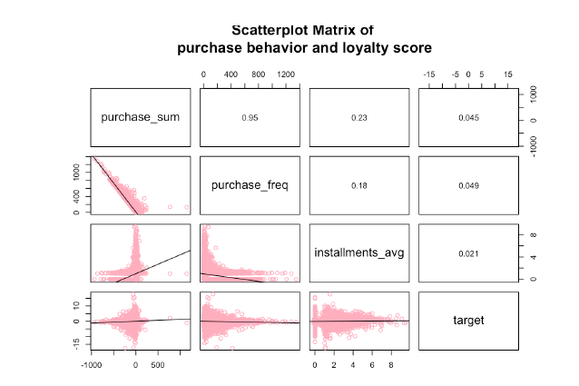
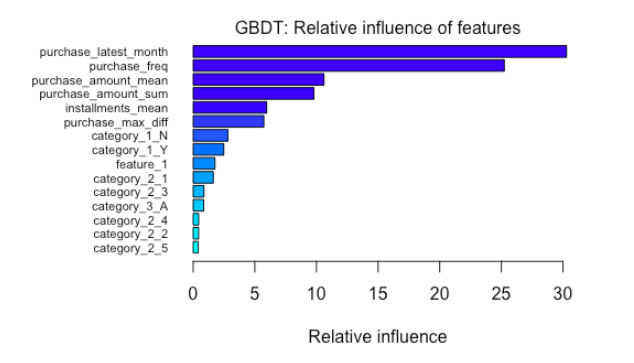

# Customer-Loyalty-Analysis-From-Purchasing-Behavior

# Introduction

Customer loyalty is important to companies because the cost of developing a new customer is much higher than maintaining an old customer. The decision makers in the company want to know if their promotions target to the right group of cardholders and how could they improve the marketing strategies in offering promotions from huge amounts of customer historical transactions. According to the need of the company, we apply regression algorithms on a broad set of explanatory variables derived from the historical transactions to predict the customer loyalty score and to find out important variables. (The loyalty score is calculated 2 months after historical and evaluation period based on new transaction. )

# Methodology

- Dataset

The datasets are retrieved from the Kaggle competition, Elo Merchant Category Recommendation. The train dataset contains basic information about cards and customer loyalty
score (target). The historical transactions dataset contains information about up to 3 months' worth of transactions for every card. Considering the computing capacity, 20,000 out of 201,917 cards were randomly picked from the train dataset. Correspondingly, around 1,800,000 rows of the transactions of these cards are extracted from the historical transactions.

- Data Preprocessing

Due to the nature of the transactional data, such as one card having multiple transactions from different merchants, it is necessary to merge the transactions of one card into a row and generate some new features by aggregating the amount, frequency and other properties. In addition, some outliers are found and dropped according to the plot of the distribution of the normalized customer loyalty score.

- Exploratory Data Analysis

(1) The plots of loyalty score distribution and first active month show that there are more activated cards and a steady trend of the score in more recent months.

(2) The scatter plot matrix is used for analyzing some purchase-relevant variables. According to the plot, total amount of purchase is highly correlated with purchase frequency,
while other variables have low linear correlation with the loyalty score.

- Random Forest

- Gradient Boosting Gradient Tree (GBDT)

- Evaluation

Root Mean Square Error (RMSE) is one of the most popular metrics for continuous variables, which represents the standard deviation of the differences between predicted values and observed values (residuals). Lower values of RMSE indicate better fit in the regression model.

# Implementation and Results

- RF and GBDT model

The plot of RF shows the Mean Squared Error and the number of trees. The error rate stabilizes around 100 trees and continues to decrease very slowly. The RMSE on test data is 1.788.

The plot of GBDT model with a learning rate 0.03 shows that the train error (black line) decreases with the increase of iteration while the error rate by the cross-validation (green line) firstly goes down and later increases slowly which indicates the model is overfitting after 235 iterations. The RMSE on test data is 1.757. 

- Importance Ranking

The best model is trained by GBDT algorithm and the RMSE on test data is 1.757.

# Finding

In the optimal model of GBDT, the top important features are the latest month of purchase, purchase frequency, purchase amount, mean of installments and maximum duration of purchases. The card categories seem not affect the customer loyalty so much. Since the data source does not provide the real category information, it could only be speculated that
the card categories have little effect on the customer loyalty score (make new transactions) in the future.

